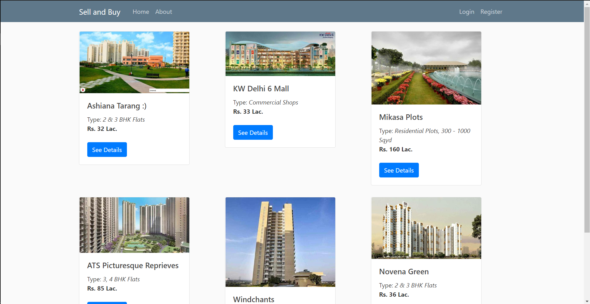

# Real_Estate_App
This is my academic DBMS project in which I use MySQL Database and use python as a back-end language using Flask framework. It's an web app which can be used to store selling and buying information of houses and this app is useful for the admin and their agents.
 
 
To run this project in local system you need install the `requirements.txt` file, which contains the name of packages that is used building of the project.
 
 
To install packages run the below command:
>pip install requirements.txt
 
And replace these with their valid values.
 

**SECRET KEY**

**DB_URI** (Write the filename of `db`. example: site.db)

**SENDGRID_KEY**

This is done at this file `real_estate_app/__init__.py`.
 
 
After completing the above requirements you can run this command `python run.py` and the server will start running as localhost.

